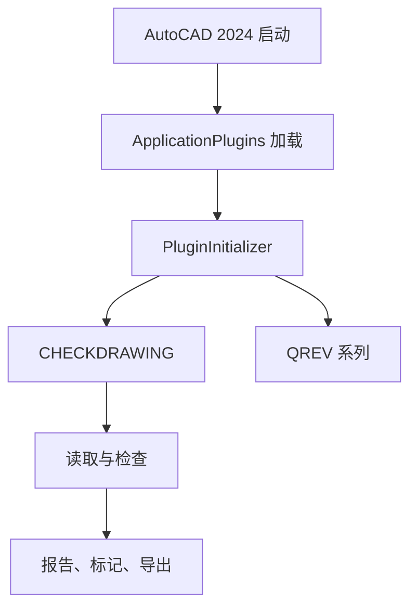

# CADCheckTool 架构说明

本文对应 v2.2.0 和 AutoCAD 2024。项目是加载到 `acad.exe` 进程内的 .NET Framework 4.8、x64 插件，不包含独立桌面主程序。

## 运行入口

`PackageContents.xml` 声明 ApplicationPlugins 包和命令。AutoCAD 启动时加载 `CADCheckTool_1.dll`，`PluginInitializer` 初始化路径配置和运行时缓存，`CommandEntry` 与 `QuickRevisionCommand` 暴露用户命令。



## 模块职责

| 目录 | 职责 |
| --- | --- |
| `Command` | AutoCAD 命令入口和批量 Session 调度 |
| `Forms` | 检查选择、单张/批量、路径设置和版本输入界面 |
| `Readers` | 布局、视口、标题栏、BOM、修改记录和 Excel 数据读取 |
| `Checks` | 标题栏、标准件、非标归档、件号、序号和版本规则 |
| `Core` | 检查编排、缓存、日志、标准件数据库和安全 DWG 保存 |
| `Markers` | 将检查结果写成布局内标记，并按专用图层清除 |
| `Batch` | 文件夹遍历、文档切换、批量检查和重量计算 |
| `Export` | 批量结果 CSV 输出 |
| `ProjectVersion` | 在所有布局中写入项目版本号 |
| `VersionCheck` | 从归档目录建立版本索引并判断最新版本 |
| `QuickRevision` | 选择目标、视口坐标转换、划线和替换文字 |
| `Configs` | 外部路径和几何规则常量 |
| `Models` | 检查、位置、表格、版本和标记的数据对象 |
| `Installer` | ApplicationPlugins 清单、Inno Setup 和交付文档 |

## 检查数据流

1. `DrawingCheckManager` 在只读事务中读取布局、标题栏、BOM、视口文字和线段。
2. `CheckService` 调用各检查器，并使用标准件、非标归档和版本归档缓存。
3. 检查结果统一写入 `CheckReport`；结果保留布局名和坐标，避免跨布局标记。
4. `MarkerManager` 在写事务中创建标记；找不到目标布局时直接跳过，不回退到当前空间。
5. 批量处理通过 `CADCHECKBATCHRUN` Session 命令切换文档，保存时使用 `SafeDwgSaver` 的临时文件、重开验证和替换流程。

## AutoCAD 约束

- 所有 `DBObject` 只在所属事务有效期内访问。
- 修改非活动文档前获取 `DocumentLock`。
- 模型空间对象经视口读取时，文字和线段必须使用同一 `ViewportId` 和同一坐标系。
- 标记写入结果携带的布局，不使用 `Database.CurrentSpaceId` 兜底。
- 批量文档切换只能在 `CommandFlags.Session` 命令上下文执行。
- AutoCAD API 程序集只用于编译，不复制进发布包。

## 配置与缓存

用户配置和日志位于 `%APPDATA%\Correct_test1`，因此当前用户安装和所有用户安装都保持独立的用户设置。缓存以配置路径和文件状态为依据刷新，不写入插件安装目录。

## 发布结构

```text
CADCheckTool.bundle/
├─ PackageContents.xml
├─ Contents/Windows/
│  ├─ CADCheckTool_1.dll
│  ├─ CADCheckTool_1.dll.config
│  └─ 运行时依赖 DLL
└─ Docs/INSTALLATION_GUIDE.md
```

发布包不包含 PDB、XML API 文档、AutoCAD API DLL、测试命令、历史注册表安装器、补丁脚本或源码。Inno Setup 根据用户选择安装到当前用户或所有用户的 ApplicationPlugins 目录。

## 兼容边界

`PackageContents.xml` 将 `SeriesMin` 和 `SeriesMax` 固定为 `R24.3`，即 AutoCAD 2024。若支持 AutoCAD 2025 及更高版本，需要建立独立的 .NET 8 构建和测试链路，不能直接复用本程序集。
